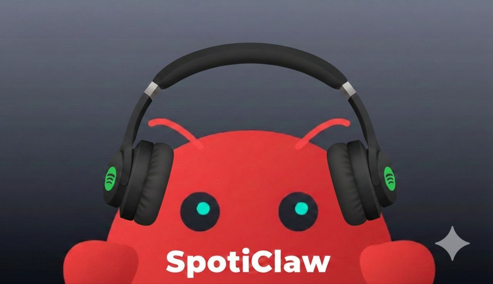

# Spoticlaw
<p align="center">
  
</p>

<p align="center"><b>Lightweight Spotify Web API client for AI agents.</b></p>

## SpotiClaw Features

- **No external dependencies** (uses direct HTTP requests)
- **Automatic token refresh** — authenticate once, works forever
- **Composable primitives** — mix and match to build complex workflows
- Full Spotify Web API coverage
- Lightweight and fast

## Composable Primitives

Combine primitives to create powerful workflows:

```python
# Example: Find an artist → get their albums → create playlist → add top tracks
artist = search().query("metallica", types=["artist"])[0]
albums = artists().get_albums(artist["id"], limit=10)
track_uris = [albums["items"][0]["tracks"]["items"][0]["uri"]]
pl = playlists().create(f"{artist['name']} Mix")
playlists().add_items(pl["id"], track_uris)
```

The primitives are designed to be combined in endless ways for any Spotify automation task.

## Quick Start

Clone and install:

**Manual step-by-step:**

1. Install dependencies (recommended: use virtual environment):
```bash
cd skills/spoticlaw

# Create venv (recommended)
python -m venv .venv
source .venv/bin/activate  # Linux/Mac
# .venv\Scripts\activate   # Windows

# Install dependencies
pip install -r scripts/requirements.txt
```

2. Configure Spotify credentials:
```bash
cp .env.example .env
# Edit .env with your Spotify app credentials
```

3. Get credentials from https://developer.spotify.com/dashboard
   - Create a new app
   - Get `Client ID` and `Client Secret`
   - Add `http://127.0.0.1:8888/callback` as Redirect URI in app settings

4. Authenticate (run on your local machine/desktop):
```bash
python scripts/auth.py
```

5. Copy the token file to the skill folder:

**Important:** The token file never passes through the AI - it's copied manually for security.

```bash
# If running locally (same machine):
cp .spotify_cache /path/to/skills/spoticlaw/.spotify_cache

# If running on a remote server, do auth first on your desktop, then copy via scp, USB, etc.
```

**That's it!** Token auto-refreshes — no need to re-authenticate.

## Quick Usage

```python
import sys
sys.path.insert(0, "skills/spoticlaw/scripts")

from spoticlaw import player, search, playlists, library

# Search
search().query("coldplay", types=["track"], limit=10)

# Play
player().play(uris=["spotify:track:..."])

# Playlists
playlists().create("My Playlist")
playlists().add_items("playlist_id", ["spotify:track:..."])

# Library
library().save(["spotify:track:..."])
```

## Token Refresh

The library automatically refreshes your access token when it expires (~60 minutes), **but only if the agent has matching app credentials** (`SPOTIFY_CLIENT_ID`, `SPOTIFY_CLIENT_SECRET`) in `.env`.

If `.spotify_cache` exists but `.env` is missing or mismatched, refresh will fail with `invalid_client`.

If you get a token error, re-run locally:
```bash
python scripts/auth.py
```
and copy the updated `.spotify_cache` to the agent skill folder.

## Quick Self-Check (No Extra Dependencies)

```bash
python scripts/selfcheck.py
```

This validates module imports and Python syntax in `scripts/`.
If auth env vars + `.spotify_cache` are present, it also runs one authenticated smoke call.

## Requirements

- Python 3.8+
- requests
- python-dotenv

## Memory (Play History)

Memory is optional and disabled by default. Enable in `.env`:
```bash
MEMORY_ENABLED=false  # default
MEMORY_ENABLED=true   # enable
```

```python
from spoticlaw import memory_add_song, player

# Manual add
memory_add_song("spotify:track:...", source="manual")

# Auto-logged on play/queue
player().play(uris=["spotify:track:..."])
player().add_to_queue("spotify:track:...")
```

Storage (default): `~/.spoticlaw/music_memory.json`

You can override it in `.env`:
```bash
MEMORY_FILE_PATH=~/.spoticlaw/music_memory.json
```

## Discovery (Last.fm)

Last.fm is optional and disabled by default. To enable, set both in `.env`:
```bash
LASTFM_ENABLED=true
LASTFM_API_KEY=your_api_key
```

```python
from spoticlaw import discover_similar_artists, discover_similar_tracks, discover_similar_genres

# Similar artists
discover_similar_artists("Modest Mouse", limit=10)

# Similar tracks
discover_similar_tracks("Dramamine", limit=10)

# Browse by genre
discover_similar_genres("jazz", limit=10)
```

All return Spotify IDs/URIs for immediate playback.

## License

MIT
